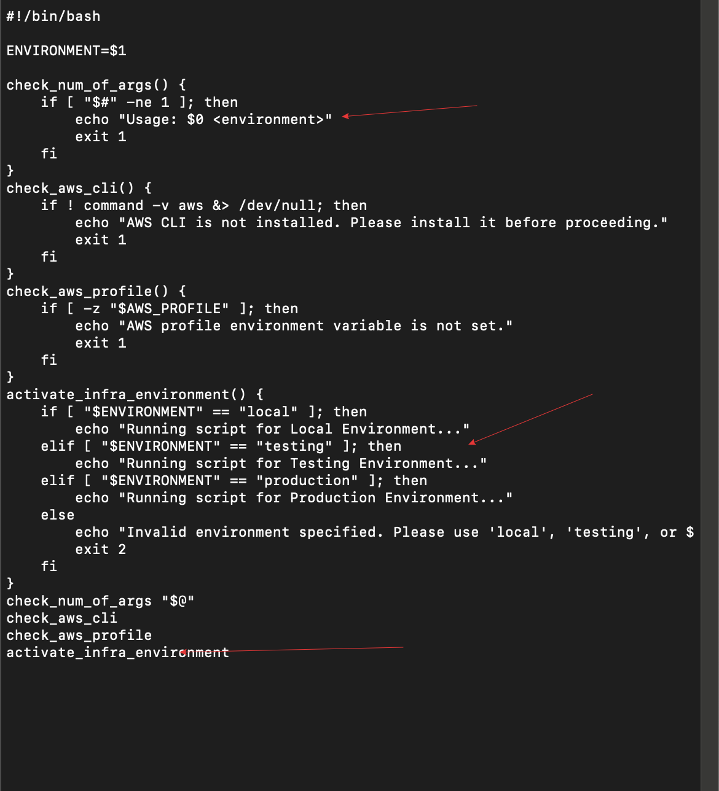

# Datawise Solutions Shell Script

> The objective of this mini project is to create a modular shell script that automates setting up EC2 instances and S3 buckets. By breaking our code into functions, making it cleaner, reusable, and easier to debug.

## Step 1: Preparing our Environment 

In the previous project, we installed and configured AWS CLI on our system.
To test, we will run the command `aws --version`.

From the picture above, we can see AWS CLI is already installed and configured. The credentials and default region have been set up.

## Step 2: Beginning the Script

- We are going to begin by creating a blank shell script file and naming it **DataWise_Script.sh**. 

- We will start the script with shebang (`#!/bin/bash`) at the top to indicate the script uses Bash.

- We will then set up the environment variable as seen below.

## Step 4: Create Functions

- We will add a function to check script arguments. We will encapsulate logic to validate the script arguments.

- We will add another function to check AWS CLI installation.

- We will add another function to verify the AWS Profile to ensure the AWS_PROFILE environment variable is set.

- Then a function to activate the infrastructure environment to act based on the argument value.

- At the bottom of the script, we will call these functions in sequence to ensure the flow.

## Step 5: Test the Script

- We will make the script executable by using the command `chmod +x DataWise_script.sh`. Then run the script with an argument `./DataWise_script.sh testing`.

## Step 6: Error
When trying to run our script (DataWise_script.sh), we ran into an issue about the AWS profile not being set.

The message indicates that our script checked for an AWS_PROFILE environment variable, but it was not set. This variable tells the AWS CLI which profile to use for authentication. Without it, the script cannot proceed with AWS operations.

## Step 7: Fixing the Error

- We ran `aws configure list` in our terminal to see if profiles are set up correctly. 

- The result showed that our AWS_PROFILE was not set, which was why the script was unable to locate the profile for authentication.

- Next, we set the AWS profile by exporting the AWS_PROFILE variable manually using the command `export AWS_PROFILE=default`.

- Then we checked to see if the profile exists by running `aws configure list-profiles`.

- The command `echo $AWS_PROFILE` was used to verify the export, after which `aws s3 ls` was used to check S3 buckets or EC2 instances.

## Step 8: Result

- We will execute the script again using the commands `./DataWise_script.sh testing`, `./DataWise_script.sh local`, and `./DataWise_script.sh production`.
In the images below, we can see the script correctly identified the environment argument we passed (testing, local, production).

## Step 9: Modifying the Script

- We will update the script to improve it by encapsulating chunks of logic into functions to make the code easier to manage and read.

### Testing, Scenarios, Results

- Run the script without any arguments.

- Unexport the AWS_PROFILE variable `unset AWS_PROFILE`.

- Below is the result of the different scenarios tested.

- Run with an invalid environment.

- Modify the script to add EC2 instance creation and S3 bucket creation.

- This script above does not contain a valid AMI ID as this is just a scenario. 

# Summary

In this project, I successfully developed a modular shell script for automating infrastructure setup with AWS CLI. By organizing tasks into well-defined functions, such as checking arguments, validating AWS CLI installation, and verifying AWS profiles, I created a script that's clean, reusable, and efficient. I learned how to streamline workflows using functions, handle errors gracefully, and integrate AWS commands like EC2 instance creation and S3 bucket management. This experience enhanced my skills in shell scripting, automation, and cloud infrastructure, while teaching me the importance of structured code.